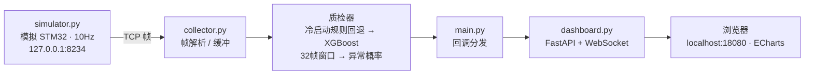
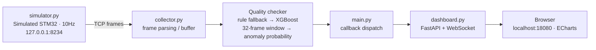

# 激光焊接机械臂预测性维护系统

> 版本 0.4 · 状态：单体测试版可端到端运行，生产版骨架建设中

## 1. 项目简介

面向焊接机械臂的预测性维护系统：采集 STM32 传感器数据，经**规则质检 + XGBoost 模型**实时判定数据质量（normal / suspicious / anomaly），并通过 Web 仪表盘可视化。

当前以 `test/` 单体应用为主，`acquisition/` 与 `processing/` 为生产版骨架。

## 2. 数据流



## 3. 目录结构

```
LaserWelding/
├── test/                    ★ 当前可运行的单体测试版
│   ├── simulator.py         STM32 数据模拟器（TCP，10Hz）
│   ├── collector.py         TCP 采集 + 帧协议解析
│   ├── data_types.py        DataPoint / QualityResult 数据模型
│   ├── quality_checker.py   规则质检（范围 / 变化率 / 冻结检测）
│   ├── xgb_checker.py       XGBoost 质检器（窗口特征 + 推理 + 规则回退）
│   ├── train_xgboost.py     窗口版模型训练脚本
│   ├── train_public_dataset.py  公开数据集模型训练脚本
│   ├── evaluate_model.py    模型评估脚本（指标 / 三档映射 / 分组 / CV）
│   ├── requirements-ml.txt  ML 依赖清单
│   ├── dashboard.py         FastAPI + WebSocket 广播
│   ├── templates/index.html ECharts 仪表盘页面
│   ├── config.py            配置（连接、日志、XGBoost 开关）
│   └── main.py              程序入口
├── models/                  模型目录（根目录，见 §5）
├── acquisition/             生产版采集层（骨架）
├── processing/              生产版处理层（骨架：synchronizer、config.yaml）
└── src/ + media/ + package.json  VS Code 扩展脚手架（Hello World 模板，与主系统无关）
```

## 4. 快速开始

### 4.1 环境准备

- Python 3.13（项目自带虚拟环境 `.venv`）
- 安装依赖：

```powershell
.\.venv\Scripts\python.exe -m pip install -r test\requirements-ml.txt
```

### 4.2 方式一：VS Code 一键运行（推荐）

1. VS Code 打开项目文件夹 `D:\SEproject\AIFirst\LaserWelding`；
2. 菜单 **终端 → 运行任务…** → 选择 **「焊接监控: 一键启动整个系统」**；
3. 模拟器和主程序分别在两个终端面板中运行，浏览器打开 http://localhost:18080 查看实时数据。

### 4.3 方式二：手动终端

```powershell
cd test
.\.venv\Scripts\python.exe simulator.py   # 终端 1，先启动
.\.venv\Scripts\python.exe main.py        # 终端 2，再启动
```

### 4.4 停止

在对应终端按 `Ctrl+C`（主程序会打印最终质检统计后优雅退出）。

## 5. 模型

### 5.1 模型位置（项目根 `models/`）

| 模型 | 说明 | 特征 |
|---|---|---|
| `xgb_anomaly` | 窗口版异常检测（主程序默认加载） | 温度 / 湿度 / 状态位的 32 帧窗口统计，19 维 |
| `xgb_public` | 公开工业机器人数据集（传感器 + 视觉） | force / proximity / temperature + 任务/物体类别 + 128 图像特征，133 维 |
| `xgb_public_sensor_only` | 公开数据集（仅传感器） | 5 维 |

每个模型目录包含 `model.json`、`features.json`、`encoders.json`、`config.json`（评估后另有 `eval_report.json`）。

### 5.2 训练

窗口版（合成数据或真实 CSV）：

```powershell
cd test
.\.venv\Scripts\python.exe train_xgboost.py
.\.venv\Scripts\python.exe train_xgboost.py --csv 你的数据.csv
```

CSV 列：`temperature, humidity, status, label`（label：0 正常 / 1 异常），可选 `run_id` 列（按焊接 run 分组切分，防泄漏）。

公开数据集版：

```powershell
.\.venv\Scripts\python.exe train_public_dataset.py [--sensor-only] [--csv 路径] [--group-col run_id]
```

### 5.3 评估

```powershell
.\.venv\Scripts\python.exe evaluate_model.py --model-dir models/xgb_public [--group-col run_id] [--cv 5]
```

输出 accuracy、balanced accuracy、ROC-AUC、PR-AUC、Brier、F1、混淆矩阵、项目三档映射（normal/suspicious/anomaly）、按任务/物体分组准确率、最佳阈值，报告保存为 `eval_report.json`。

### 5.4 防数据泄漏

- 按 `run_id` 分组切分（GroupShuffleSplit / GroupKFold）：**同一个焊接 run 只进入训练/验证/测试中的一个集合**；
- 训练与评估脚本自动检测 `run_id` 列；少于 3 个 run 拒绝切分；无 `run_id` 时打印 `NOT leakage-safe` 警告。

## 6. 配置说明（`test/config.py`）

| 配置 | 说明 |
|---|---|
| `SWITCH_IP` / `SWITCH_PORT` | 数据源地址（默认 127.0.0.1:8234） |
| `USE_XGBOOST` | 是否优先加载 XGBoost 质检器（`False` 时只用规则质检） |
| `XGB_MODEL_PATH` / `XGB_WINDOW_SIZE` | 模型路径与滑动窗口长度 |
| `LOG_DIR` / `LOG_LEVEL` / `LOG_ROTATION` | 日志目录、级别、轮转策略 |

质检三档阈值（normal ≥ 0.8 / suspicious ≥ 0.4 / anomaly 概率 > 0.6）在 `test/xgb_checker.py` 中可调。

## 7. 注意事项

- 当前模型基于**合成/公开数据**训练，指标（99%+）不代表真实焊接现场；正式使用请用真实带标签数据重训并重新标定阈值。
- 公开数据集模型是**逐行分类**（单条观测 → 标签），与窗口版质检器（32 帧窗口）的特征体系不同，两者不能直接互换。
- `__pycache__`、`logs/`、`models/` 尚未加入 `.gitignore`，提交前建议补充。

---

# Laser Welding Robotic Arm Predictive Maintenance System

> Version 0.4 · Status: the monolith test build runs end-to-end; the production build is a skeleton under construction.

## 1. Overview

A predictive maintenance system for welding robotic arms. It collects STM32 sensor data, evaluates data quality in real time (**normal / suspicious / anomaly**) using rule-based checks combined with an XGBoost model, and visualizes the results through a web dashboard.

The `test/` monolith is currently the focus; `acquisition/` and `processing/` are skeletons for the production version.

## 2. Data Flow



## 3. Directory Structure

```
LaserWelding/
├── test/                    ★ Runnable monolith test build
│   ├── simulator.py         STM32 data simulator (TCP, 10Hz)
│   ├── collector.py         TCP acquisition + frame protocol parsing
│   ├── data_types.py        DataPoint / QualityResult data models
│   ├── quality_checker.py   Rule-based quality checks (range / rate / freeze)
│   ├── xgb_checker.py       XGBoost checker (window features + inference + rule fallback)
│   ├── train_xgboost.py     Window-based model training script
│   ├── train_public_dataset.py  Public-dataset model training script
│   ├── evaluate_model.py    Evaluation script (metrics / 3-class mapping / groups / CV)
│   ├── requirements-ml.txt  ML dependencies
│   ├── dashboard.py         FastAPI + WebSocket broadcast
│   ├── templates/index.html ECharts dashboard page
│   ├── config.py            Configuration (connection, logging, XGBoost switch)
│   └── main.py              Entry point
├── models/                  Trained models (project root, see §5)
├── acquisition/             Production acquisition layer (skeleton)
├── processing/              Production processing layer (skeleton: synchronizer, config.yaml)
└── src/ + media/ + package.json  VS Code extension scaffold (Hello World template, unrelated to the main system)
```

## 4. Quick Start

### 4.1 Prerequisites

- Python 3.13 (the project ships its own virtual environment `.venv`)
- Install dependencies:

```powershell
.\.venv\Scripts\python.exe -m pip install -r test\requirements-ml.txt
```

### 4.2 Option 1: One-click run in VS Code (recommended)

1. Open the project folder `D:\SEproject\AIFirst\LaserWelding` in VS Code;
2. Menu **Terminal → Run Task…** → select **「焊接监控: 一键启动整个系统」** (Welding Monitor: start the whole system);
3. The simulator and the main program run in two terminal panels; open http://localhost:18080 to view real-time data.

### 4.3 Option 2: Manual terminals

```powershell
cd test
.\.venv\Scripts\python.exe simulator.py   # Terminal 1, start first
.\.venv\Scripts\python.exe main.py        # Terminal 2, start second
```

### 4.4 Stopping

Press `Ctrl+C` in the corresponding terminal (the main program prints final quality statistics and exits gracefully).

## 5. Models

### 5.1 Model Location (project-root `models/`)

| Model | Description | Features |
|---|---|---|
| `xgb_anomaly` | Window-based anomaly detection (loaded by default) | 32-frame window statistics of temperature / humidity / status, 19 dims |
| `xgb_public` | Trained on a public industrial-robot dataset (sensors + vision) | force / proximity / temperature + task/object categories + 128 image features, 133 dims |
| `xgb_public_sensor_only` | Public dataset, sensors only | 5 dims |

Each model directory contains `model.json`, `features.json`, `encoders.json`, `config.json` (plus `eval_report.json` after evaluation).

### 5.2 Training

Window-based (synthetic data or a labeled CSV):

```powershell
cd test
.\.venv\Scripts\python.exe train_xgboost.py
.\.venv\Scripts\python.exe train_xgboost.py --csv your_data.csv
```

CSV columns: `temperature, humidity, status, label` (label: 0 normal / 1 anomaly), optional `run_id` column (grouped by welding run to prevent leakage).

Public-dataset variant:

```powershell
.\.venv\Scripts\python.exe train_public_dataset.py [--sensor-only] [--csv path] [--group-col run_id]
```

### 5.3 Evaluation

```powershell
.\.venv\Scripts\python.exe evaluate_model.py --model-dir models/xgb_public [--group-col run_id] [--cv 5]
```

Reports accuracy, balanced accuracy, ROC-AUC, PR-AUC, Brier, F1, confusion matrix, the project's three-class mapping (normal / suspicious / anomaly), per-task / per-object accuracy, and the best threshold; the report is saved to `eval_report.json`.

### 5.4 Preventing Data Leakage

- Splits are grouped by `run_id` (GroupShuffleSplit / GroupKFold): **a welding run goes into exactly one of train / val / test**;
- Training and evaluation scripts auto-detect a `run_id` column; they refuse to split with fewer than 3 runs; without `run_id` they print a `NOT leakage-safe` warning.

## 6. Configuration (`test/config.py`)

| Key | Description |
|---|---|
| `SWITCH_IP` / `SWITCH_PORT` | Data source address (default 127.0.0.1:8234) |
| `USE_XGBOOST` | Whether to prefer the XGBoost checker (`False` = rule-based only) |
| `XGB_MODEL_PATH` / `XGB_WINDOW_SIZE` | Model path and sliding-window length |
| `LOG_DIR` / `LOG_LEVEL` / `LOG_ROTATION` | Log directory, level, rotation policy |

The three-class thresholds (normal ≥ 0.8 / suspicious ≥ 0.4 / anomaly probability > 0.6) can be tuned in `test/xgb_checker.py`.

## 7. Notes

- Current models are trained on **synthetic / public** data; their metrics (99%+) do not represent real welding-site performance. Retrain with real labeled data and recalibrate thresholds before production use.
- The public-dataset model is a **row-level classifier** (one observation → label) and cannot be swapped directly with the window-based checker (32-frame window), because their feature spaces differ.
- `__pycache__`, `logs/`, and `models/` are not yet in `.gitignore`; consider adding them before committing.
