# 激光焊接机械臂预测性维护系统——三周工作汇报

## 一、三周工作的总体目标

这三周的工作不是单纯继续提高某一个 XGBoost 模型的精度，而是围绕以下三个问题推进：

1. 现有数据能否支撑可信的模型实验；
2. 除 XGBoost 外，哪些模型适合不同类型的数据和任务；
3. 如何把算法实验、工业相机、STM32 数据和未来的机械臂控制器数据，整理成一个可继续扩展的正式系统。

目前形成的阶段性成果是：完成了数据集评估与防泄漏验证，建立了监督、无监督和多输出模型的对比框架；同时将原来集中在 `test/` 中的演示程序整理为正式应用框架，并完成海康工业相机的 SDK 发现与接入验证。

> 汇报口径说明：目前完成的是“多种数据模态的接入架构和单模态模型实验”，尚未获得同一次真实焊接过程中的完整同步多模态数据，因此不能表述为“已经完成多模态融合模型训练”。

---

## 二、按三周划分的工作内容

### 第一周：数据集筛选、任务定义和评估方法修正

#### 1. 对现有数据进行分类

项目中的数据被划分为三类：

| 数据 | 内容 | 当前用途 | 可信度判断 |
|---|---|---|---|
| 钢—铜搭接接头 V1 | 360 行，6 个工艺参数、裂纹标签和 4 项几何测量 | 工艺参数模型的分类、回归和模型对比 | 当前唯一带真实金相标签的数据，但独立焊缝数量过少 |
| 钢—铜搭接接头 V2 | 18 行，含工艺参数和铜侧熔深 | 作为趋势和数据格式参考 | 无裂纹标签、样本过少，不作为主要监督训练集 |
| STM32 合成时序 | 温度、电压、状态位，10 Hz | 联调实时链路、验证滑动窗口算法 | 只用于软件和算法流程验证，不作为产线结论 |

#### 2. 确定主实验数据集

当前主实验选择 **Definitive screening steel-copper lap joints V1**，原因是它具有真实实验标签，能够同时支持：

- 裂纹二分类；
- 钢侧熔宽、铜侧熔宽、铜侧熔深和间隙的回归；
- 多种机器学习模型在相同输入和相同评估协议下进行公平对比。

数据的基本情况如下：

- 总记录数：360；
- 裂纹正样本：50，占 13.9%；
- 独立焊缝数：5；
- 每道焊缝包含 72 个横截面采样位置。

#### 3. 修正评估方法，避免数据泄漏

360 行记录并不等于 360 次独立焊接实验。同一道焊缝上的 72 个横截面具有很强相关性。如果随机把这些横截面拆入训练集和测试集，模型可能只是识别同一道焊缝，而不是预测一条没见过的新焊缝。

因此正式实验统一采用：

```text
GroupKFold（5 折）
分组字段：weld number
原则：同一道焊缝的全部横截面只能出现在同一个折中
```

这一调整是数据工作中最重要的结果。现有精度只能说明模型在这 5 道焊缝上的趋势，不能直接等同于产线泛化能力。下一阶段比继续微调模型更重要的是增加独立焊缝样本。

#### 4. 对激光器供电电流数据进行调研

曾针对“激光焊接过程中激光器供电电流”寻找公开数据。检索到的研究多数只公开整机功率或能耗统计，少数论文记录了高频电流、电压，但没有公开可直接训练的原始波形。因此暂未把来源不清或字段不匹配的数据加入项目，后续优先依靠设备接口实测并记录电流、电压、时间戳和焊接批次。

---

### 第二周：从单一 XGBoost 扩展为多模型体系

#### 1. 增加 5 种监督学习模型

在同一 V1 数据、同一输入特征和同一 GroupKFold 协议下，对以下模型进行比较：

| 模型 | 作用和特点 |
|---|---|
| XGBoost | 当前基准模型，适合表格特征和非线性关系 |
| Random Forest | 对小规模表格数据较稳健，可作为时序窗口模型候选 |
| Extra Trees | 随机性更强，适合检验树模型结果是否稳定 |
| HistGradientBoosting | 另一类梯度提升实现，用于比较提升树家族 |
| Logistic Regression | 线性、易解释的基线，判断复杂模型是否真正带来收益 |

裂纹分类初步结果如下：

| 模型 | Accuracy | Balanced Accuracy | F1 | ROC-AUC | PR-AUC |
|---|---:|---:|---:|---:|---:|
| XGBoost | 0.9556 | 0.9658 | 0.8596 | 0.9795 | 0.8241 |
| Random Forest | 0.9556 | 0.9658 | 0.8596 | 0.9806 | **0.8601** |
| Extra Trees | 0.9556 | 0.9658 | 0.8596 | **0.9813** | 0.8570 |
| HistGradientBoosting | **0.9583** | 0.9423 | **0.8598** | 0.9802 | 0.8216 |
| Logistic Regression | 0.9389 | 0.9645 | 0.8197 | 0.9798 | 0.7805 |

结果表明，不同模型的指标非常接近。Extra Trees 的 ROC-AUC 略高，Random Forest 的 PR-AUC 略高，但差异小于仅有 5 道独立焊缝带来的不确定性。因此当前没有充分依据只凭小数点后的差异替换 XGBoost。

阶段性结论是：**现阶段主要瓶颈是数据规模和独立样本数量，而不是缺少更复杂的模型。**

#### 2. 建立多输出模型实验

除裂纹分类外，还建立了“工艺参数 + 横截面位置 → 多个输出”的实验分支：

- 裂纹：分类；
- 钢侧熔宽：回归，R² = 0.864；
- 铜侧熔宽：回归，R² = 0.906；
- 铜侧熔深：回归，R² = 0.878；
- 间隙：回归，R² = 0.586。

该实验说明同一组工艺参数可以服务于多个预测目标，但这些质量相关实验仅作为算法研究记录。按照当前第一版系统范围，不在正式界面展示焊接状态、缺陷识别或视觉质量结果。

#### 3. 增加无监督与统计异常检测方法

考虑到预测性维护中真实故障标签通常很少，项目增加了不完全依赖异常标签的方法库：

- Z-Score；
- Isolation Forest；
- Local Outlier Factor；
- One-Class SVM；
- PCA + Mahalanobis Distance；
- Gaussian Mixture Model；
- MLP Autoencoder。

这些方法以 32 帧传感器窗口的统计特征为输入，输出异常分数。目前已完成算法接口和演示性比较，但使用的是合成时序，不能作为实际故障检出率。它们的意义是为以后真实电流、电压、温度和控制器数据到位后保留候选方案。

#### 4. 时序窗口模型对比

在 60 条合成序列、32 帧窗口的统一协议下，Random Forest 的 ROC-AUC 为 0.9514，高于 XGBoost 的 0.9342，成为当前时序窗口任务的候选模型。但由于数据是合成的，最终选型必须在真实设备时序数据上重新进行。

---

### 第三周：正式系统整理和多模态接入基础

#### 1. 从 `test/` 演示程序向正式工程迁移

将原有单体演示程序中的可用能力整理为正式应用结构，增加了：

- 统一配置和启动入口；
- 设备、服务、接口和页面的分层；
- 统一设备事件结构；
- 健康检查、相机状态接口和实时预览入口；
- 日志和错误回退；
- 单元测试与基本服务验证。

正式事件结构统一记录 `device_id`、数据来源、事件类型、设备采样时间、系统接收时间、数据单位、有效性和扩展元数据。这为以后不同设备按时间对齐奠定了基础。

#### 2. 工业相机接入

已完成海康 MVS SDK 的加载和 GigE 相机发现，识别到：

- 型号：MV-CU013-A0GC；
- 分辨率：1280 × 1024；
- 接口：GigE；
- 相机 IP：169.254.2.151；
- 电脑与相机已通过交换机处于同一网段。

当前已验证系统能够发现相机，并已准备相机适配器、状态接口和预览服务。联调过程中发现画面明暗异常的主要原因是相机没有安装合适镜头，而不是网络或 SDK 故障；根据约 2 m 工作距离和约 0.8 m × 1.2 m 覆盖范围，已转入 8 mm C 接口镜头采购和后续实拍标定。

第一版中相机只用于实时画面和三天视频留存，不进行焊缝视觉质量或缺陷识别。

#### 3. STM32 与机械臂接口边界

- STM32：继续保留模拟数据源，保证没有传感器硬件时仍可联调；后续接入真实激光器供电电流、电压等信号；
- 机械臂：第一版不下发控制指令，只做运行状态、轨迹和工艺参数的可视化及预测性维护；
- 控制器接口尚未具备实机联调条件，当前在交换机采集层预留只读监听接口；
- 系统后续可通过绑定局域网 IP、放行 Windows 防火墙端口实现局域网浏览器访问，技术难度不高，但需要补充访问权限和网络安全配置。

---

## 三、当前定义的多模态工作场景

### 1. 多模态来源

| 模态 | 当前状态 | 第一版用途 | 后续算法用途 |
|---|---|---|---|
| 工艺参数表格 | 已有公开小样本 | 实验与风险基线 | 批次级风险模型 |
| STM32/电气时序 | 模拟源已可运行 | 实时链路联调 | 电流、电压、温度异常检测 |
| 工业相机视频 | 已发现真机，待镜头实拍 | 现场画面与三天留存 | 当前不做视觉识别，后期再评估 |
| 机械臂控制器数据 | 已预留接口 | 状态、轨迹、工艺参数可视化 | 轨迹偏差、负载和设备退化分析 |
| 系统日志与设备事件 | 正式框架已建立 | 断连、异常和运行记录 | 事件关联和故障追溯 |

### 2. 工作流程

```mermaid
flowchart LR
    A[工艺参数] --> S[统一时间戳与焊接批次]
    B[STM32与电气时序] --> S
    C[工业相机视频] --> S
    D[机械臂状态与轨迹] --> S
    E[系统日志] --> S
    S --> V[实时可视化与数据留存]
    S --> M1[表格数据模型]
    S --> M2[时序异常模型]
    M1 --> F[后期分数级融合]
    M2 --> F
    F --> P[预测性维护提示]
```



第一版采用分阶段方案：先让各模态能够稳定采集、统一时间戳并关联到同一次焊接任务；模型分别对表格数据和时序数据产生结果；待积累真实同步数据后再做分数级后融合。这样能够处理不同采样频率、暂时缺失某一设备数据等工业现场常见情况。

这里的“多模态”主要服务于机械臂和激光设备的状态监测与预测性维护，不包含自动控制，也不包含焊接视觉质量判断。


## 四、完成程度与边界

| 内容 | 状态 | 说明 |
|---|---|---|
| 数据集统计和可用性评估 | 已完成 | V1 为主、V2 为参考、合成时序只用于联调 |
| 按焊缝分组的防泄漏评估 | 已完成 | 统一采用 GroupKFold |
| 5 种监督模型横向比较 | 已完成 | 已生成可复现实验报告 |
| 7 种无监督/统计方法接口 | 已完成候选库 | 仍需真实时序重新验证 |
| 多输出分类与回归实验 | 已完成初步实验 | 仅作研究结果，不进入第一版正式展示 |
| 正式应用框架 | 已建立 | 原 `test/` 能力正在分阶段迁移 |
| 工业相机发现与 SDK 接入 | 已完成 | 待镜头到货后完成真实画面、参数和稳定性测试 |
| 视频保存三天 | 已确定需求 | 尚需完成录像切片、索引和自动清理 |
| 机械臂控制器数据 | 已预留接口 | 等控制器协议和实机条件 |
| 多模态融合模型 | 尚未训练 | 需先获得真实同步多模态数据 |
| 自动控制机械臂 | 不在第一版范围 | 第一版始终保持只读监测 |

---

## 五、下一阶段建议

1. 镜头到货后完成相机连续采集、曝光/增益调试、掉线恢复和三天视频循环保存；
2. 明确激光器或电源的电流采集接口、量程、采样频率和时间戳方式，形成真实 STM32 时序数据；
3. 获取机械臂控制器的只读协议和字段表，先实现状态、轨迹和工艺参数显示；
4. 建立统一的焊接任务 ID，把相机、STM32、控制器和日志数据对齐；
5. 真实数据积累后重新比较 XGBoost、Random Forest、Extra Trees 和无监督方法；
6. 在独立焊接任务数量达到可评估规模后，再开展多模态后融合和预测性维护阈值标定。


