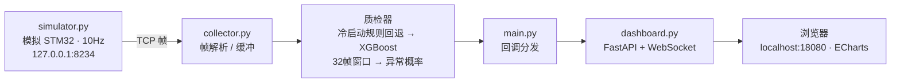
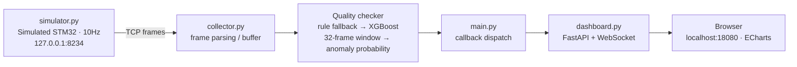

# 激光焊接机械臂预测性维护系统

> 版本 0.5 · 状态：正式五层架构已贯通；电流与视频已接入，温度矩阵和机械臂数据已有正式接口

## 1. 项目简介

面向焊接机械臂的预测性维护系统：统一采集电流/电压、焊接视频、温度矩阵和机械臂速度/时间，经过独立的数据质量检测、XGBoost 分析和数据传输层，通过 Web 仪表盘可视化。

正式入口为 `app/`；代码按 `data_collection`、`data_quality`、`data_analysis`、`frontend`、`data_transport` 五层组织。`test/` 只保留历史实验和回归参考，不再作为正式主链路。

当前所有 XGBoost 模型均已纳入统一注册表，但它们预测的是窗口异常、裂纹和焊缝几何，并非机械臂故障时间或剩余寿命。预测性维护还需要真实故障码、维修工单和部件更换记录作为监督标签。完整边界与路线见
[docs/08_正式代码分层与预测性维护路线.md](docs/08_正式代码分层与预测性维护路线.md)。

正式化工作的范围、现状盘点、模块迁移边界和后续验收条件，见
[docs/05_现状盘点与正式化迁移清单.md](docs/05_现状盘点与正式化迁移清单.md)。

正式应用入口已经建立。工业相机接入和当前硬件联调条件见
[docs/06_正式框架与工业相机接入.md](docs/06_正式框架与工业相机接入.md)。启动正式系统：

三周阶段工作、数据集选择、多模型扩展和多模态路线的汇报材料见
[docs/07_三周工作汇报.md](docs/07_三周工作汇报.md)。

```powershell
.\scripts\run.ps1
```

## 2. 数据流



## 3. 目录结构

```
LaserWelding/
├── test/                    ★ 当前可运行的单体测试版
│   ├── simulator.py         STM32 数据模拟器（TCP，10Hz）
│   ├── collector.py         TCP 采集 + 帧协议解析
│   ├── data_types.py        DataPoint / QualityResult 数据模型
│   ├── quality_checker.py   规则质检（范围 / 变化率 / 冻结检测）
│   ├── xgb_checker.py       XGBoost 质检器（窗口特征 + 推理 + 规则回退）
│   ├── train_xgboost.py     窗口版模型训练脚本
│   ├── train_public_dataset.py  V1 变体模型训练脚本（xgb_public 系列）
│   ├── evaluate_model.py    模型评估脚本（指标 / 三档映射 / 分组 / CV）
│   ├── requirements.txt     完整运行依赖清单
│   ├── requirements-ml.txt  ML 依赖子集
│   ├── dashboard.py         FastAPI + WebSocket 广播
│   ├── templates/index.html ECharts 仪表盘页面
│   ├── config.py            配置（连接、日志、XGBoost 开关）
│   └── main.py              程序入口
├── models/                  模型目录（根目录，见 §5）
├── acquisition/             生产版采集层（骨架）
├── processing/              生产版处理层（骨架：synchronizer、config.yaml）
└── src/ + media/ + package.json  VS Code 扩展脚手架（Hello World 模板，与主系统无关）
```

## 4. 快速开始

### 4.1 新电脑运行准备（需要下载 / 安装的东西）

| 需要的东西 | 说明 |
|---|---|
| 项目代码 + 模型文件 | 整个项目目录，务必包含 `models/`（`model.json`、`features.json`、`encoders.json` 等；模型缺失时主程序自动回退为规则质检） |
| Python 3.13 | 可复用项目自带的 `.venv`，或自行安装 Python 后重建虚拟环境 |
| 全部依赖包 | 一条命令：`pip install -r test\requirements.txt`（fastapi、uvicorn、websockets、numpy、scipy、scikit-learn、xgboost） |
| ECharts 图表库 | 前端从 jsDelivr CDN 加载；新电脑**需要联网才能显示图表**；断网时 KPI/告警/数据流照常（已加兜底），仅图表留空 |
| （可选）VS Code | 推荐，已配置「一键启动整个系统」任务 |
| （可选）搭接接头数据集 | 仅重训 4 个 V1 模型时需要（`V1.xlsx` 路径见 §5.2） |
| （可选）问答模型 | 使用问答功能需 `pip install openai`（已含在 requirements.txt）；云端需 API Key，本地需装 Ollama 并拉取视觉模型（见 §8） |

完整运行指南见 [运行指南.md](运行指南.md)。

### 4.2 方式一：VS Code 一键运行（推荐）

1. VS Code 打开项目文件夹 `D:\SEproject\AIFirst\LaserWelding`；
2. 菜单 **终端 → 运行任务…** → 选择 **「焊接监控: 一键启动整个系统」**；
3. 模拟器和主程序分别在两个终端面板中运行，浏览器打开 http://localhost:18080 查看实时数据。

### 4.3 方式二：手动终端

```powershell
cd test
.\.venv\Scripts\python.exe simulator.py   # 终端 1，先启动
.\.venv\Scripts\python.exe main.py        # 终端 2，再启动
```

### 4.4 停止

在对应终端按 `Ctrl+C`（主程序会打印最终质检统计后优雅退出）。

## 5. 模型

### 5.1 模型位置（项目根 `models/`）

| 模型 | 说明 | 特征 |
|---|---|---|
| `xgb_anomaly` | 窗口版异常检测（主程序默认加载；**保留合成数据版**，见 §7） | 温度 / 电压 / 状态位的 32 帧窗口统计，19 维 |
| `xgb_public` | 钢-铜搭接接头裂纹预测（V1 全特征版，随机分层切分） | 6 维工艺参数 |
| `xgb_public_group` | 裂纹预测（V1 全特征版，按焊缝分组切分，防泄漏） | 6 维工艺参数 |
| `xgb_public_sensor_only` | 裂纹预测（V1 核心工艺参数子集版，消融） | 4 维（功率/速度/气流量/板厚） |
| `xgb_lap_joint` | 钢-铜搭接接头裂纹预测（工艺参数 → 裂纹，基准模型） | 6 维工艺参数 |
| `xgb_multiout` | **多输出质量模型**（V1 真实数据）：工艺(+横截面位置) → 裂纹 + 钢侧/铜侧熔宽、铜侧熔深、间隙 | 6~7 维输入，1 分类 + 4 回归 |

每个模型目录包含 `model.json`、`features.json`、`config.json`；`xgb_public` 系列另有 `encoders.json`，评估后各有 `eval_report.json`。

### 5.2 训练

窗口版（合成数据或真实 CSV）：

```powershell
cd test
.\.venv\Scripts\python.exe train_xgboost.py
.\.venv\Scripts\python.exe train_xgboost.py --csv 你的数据.csv
```

CSV 列：`temperature, voltage, status, label`（label：0 正常 / 1 异常），可选 `run_id` 列（按焊接 run 分组切分，防泄漏）。

> 注：`xgb_anomaly` 保留合成数据版（2026-09 决定），未用搭接接头 V1 重训——V1 只有工艺参数，没有温度/电压时间序列。

搭接接头 V1 变体版（`xgb_public` 系列）：

```powershell
.\.venv\Scripts\python.exe train_public_dataset.py                        # 训练全部 3 个变体
.\.venv\Scripts\python.exe train_public_dataset.py --variant group        # 只训练其中一个
.\.venv\Scripts\python.exe train_public_dataset.py --variant sensor-only
```

数据：`Definitive screening steel-copper lap joints V1.xlsx`（360 行，310 no / 50 yes 裂纹；V2 无裂纹标签，仅作补充参考）。`xgb_public` / `xgb_public_sensor_only` 为随机分层切分（不防泄漏），`xgb_public_group` 按 `weld number` 分组切分（防泄漏）。

钢-铜搭接接头裂纹预测（工艺参数 → 裂纹是/否）：

```powershell
.\.venv\Scripts\python.exe train_lap_joint.py
```

数据：`Definitive screening steel-copper lap joints V1.xlsx`（360 行，按 `weld number` 分组切分防泄漏；V2 无裂纹标签，仅作补充参考）。
预测/查看：`python predict_lap_joint.py --power 1050 --speed 1 --gas 15 --focal 0 --angular 0 --thickness 0.6`，或网页 http://localhost:18080/lap-joint（含 VS Code 任务「焊接监控: 裂纹模型预测」）。
模型指标：`python evaluate_lap_joint.py`（F1/精确率/召回率/AUC/混淆矩阵，VS Code 任务「焊接监控: 查看裂纹模型指标」）。

### 5.3 评估

```powershell
.\.venv\Scripts\python.exe evaluate_model.py --model-dir models/xgb_public [--cv 5]
```

输出 accuracy、balanced accuracy、ROC-AUC、PR-AUC、Brier、F1、混淆矩阵、项目三档映射（normal/suspicious/anomaly）、按焊缝分组准确率、最佳阈值，报告保存为 `eval_report.json`。

### 5.4 防数据泄漏

- 按 `run_id` 分组切分（GroupShuffleSplit / GroupKFold）：**同一个焊接 run 只进入训练/验证/测试中的一个集合**；
- 窗口版（`train_xgboost.py`）按 `run_id` 分组；V1 版（`train_lap_joint.py` / `train_public_dataset.py --variant group`）按 `weld number` 分组；评估脚本默认按 `weld number` 分组。
- 分组数少于 3 时拒绝切分；无分组列时打印 `NOT leakage-safe` 警告。

### 5.5 检测方法（可扩展）

实时检测支持多种方法，可一键对比（`python detect_demo.py`，VS Code 任务「焊接监控: 多方法检测演示」）：

| 方法 | 类型 | 说明 |
|---|---|---|
| 规则质检 | 规则 | 范围 / 变化率 / 冻结检测（冷启动兜底） |
| XGBoost 窗口模型 | 监督 | 32 帧窗口特征 → 异常概率（默认） |
| Z-Score 统计 | 无监督 | 特征与正常基线偏差 |
| Isolation Forest | 无监督 | 随机划分孤立异常点 |
| Local Outlier Factor | 无监督 | 局部密度离群 |
| One-Class SVM | 无监督 | 单类支持向量机 |
| PCA + 马氏距离 | 无监督 | 主成分降维后距离偏离 |
| Gaussian Mixture | 无监督 | 混合高斯密度估计 |
| MLP Autoencoder | 无监督 | 重建误差检测异常 |

终端演示会输出各方法在正常段/异常段上的准确率、逐窗口判定（A/N）和综合投票。

## 6. 配置说明（`test/config.py`）

| 配置 | 说明 |
|---|---|
| `SWITCH_IP` / `SWITCH_PORT` | 数据源地址（默认 127.0.0.1:8234） |
| `USE_XGBOOST` | 是否优先加载 XGBoost 质检器（`False` 时只用规则质检） |
| `XGB_MODEL_PATH` / `XGB_WINDOW_SIZE` | 模型路径与滑动窗口长度 |
| `LOG_DIR` / `LOG_LEVEL` / `LOG_ROTATION` | 日志目录、级别、轮转策略 |
| `VIDEO_ENABLED` / `VIDEO_SOURCE_TYPE` / `VIDEO_RTSP_URL` / `VIDEO_FPS` | 视频接口预留配置（未启用；接口见 `/api/video/status`、`/ws/video`） |

质检三档阈值（normal ≥ 0.8 / suspicious ≥ 0.4 / anomaly 概率 > 0.6）在 `test/xgb_checker.py` 中可调。

## 7. 注意事项

- 除 `xgb_anomaly` 外的 4 个模型均基于**钢-铜搭接接头 V1 数据**（360 行）训练，样本量小、裂纹正样本仅 50 条，指标（accuracy ~0.91、F1 ~0.75）不代表真实产线；正式使用请用更大规模真实带标签数据重训并重新标定阈值。
- `xgb_public` 系列与 `xgb_lap_joint` 都是**逐行分类**（工艺参数 → 裂纹），与窗口版质检器（32 帧温度/电压窗口）的特征体系不同，两者不能直接互换。
- `xgb_anomaly` 保留合成数据训练的窗口模型：搭接接头 V1 数据只有工艺参数、没有温度/电压时间序列，无法按原定义重训；实时异常检测继续依赖它（缺失时主程序自动回退规则质检）。
- 前端已为 ECharts 加载失败加了兜底：图表库不可用（断网 / CDN 被墙）时，KPI 卡片、告警列表和数据流照常工作，只有图表区域留空。
- `__pycache__`、`logs/`、`models/` 尚未加入 `.gitignore`，提交前建议补充。
## 8. 激光焊接问答（多模态 QA）

项目内置一个多模态问答模块：可以针对激光焊接的工艺、缺陷、质量与维护问题提问，也支持上传焊接图像让模型"看图回答"（如识别缺陷）。统一使用 OpenAI 兼容接口，通过 `test/config.py` 切换两种部署方式：

**方式一：云端模型（本机推荐）**——无需本地显卡，需要联网和 API Key：

| 配置 | 示例 |
|---|---|
| `QA_BACKEND` | `"cloud"` |
| `QA_MODEL` | `qwen-vl-max`（阿里云百炼）或 `gpt-4o` |
| `QA_API_BASE` | `https://dashscope.aliyuncs.com/compatible-mode/v1`（按服务商填写） |
| `QA_API_KEY` | 你的密钥（建议放环境变量，勿提交 git） |

**方式二：本地模型（工作室电脑推荐）**——数据不出内网，需要 GPU：

1. 安装 Ollama：https://ollama.com
2. 拉取视觉模型：`ollama pull qwen3-vl:8b`
3. 配置：

| 配置 | 示例 |
|---|---|
| `QA_BACKEND` | `"local"` |
| `QA_MODEL` | `qwen3-vl:8b` |
| `QA_API_BASE` | `http://localhost:11434/v1` |
| `QA_API_KEY` | 留空 |

依赖：`pip install openai`（已包含在 `requirements.txt`）。使用方法：

- 网页问答：启动系统后访问 http://localhost:18080/qa（先设 `QA_ENABLED = True`）
- 命令行问答：`python qa_cli.py "激光焊接为什么产生气孔？"`；看图：`python qa_cli.py "这个焊缝有什么缺陷？" --image weld.jpg`


---

# Laser Welding Robotic Arm Predictive Maintenance System

> Version 0.4 · Status: the monolith test build runs end-to-end; the production build is a skeleton under construction.

## 1. Overview

A predictive maintenance system for welding robotic arms. It collects STM32 sensor data, evaluates data quality in real time (**normal / suspicious / anomaly**) using rule-based checks combined with an XGBoost model, and visualizes the results through a web dashboard.

The `test/` monolith is currently the focus; `acquisition/` and `processing/` are skeletons for the production version.

## 2. Data Flow



## 3. Directory Structure

```
LaserWelding/
├── test/                    ★ Runnable monolith test build
│   ├── simulator.py         STM32 data simulator (TCP, 10Hz)
│   ├── collector.py         TCP acquisition + frame protocol parsing
│   ├── data_types.py        DataPoint / QualityResult data models
│   ├── quality_checker.py   Rule-based quality checks (range / rate / freeze)
│   ├── xgb_checker.py       XGBoost checker (window features + inference + rule fallback)
│   ├── train_xgboost.py     Window-based model training script
│   ├── train_public_dataset.py  V1 variant training script (xgb_public family)
│   ├── evaluate_model.py    Evaluation script (metrics / 3-class mapping / groups / CV)
│   ├── requirements.txt     Full runtime dependency list
│   ├── requirements-ml.txt  ML-only dependency subset
│   ├── dashboard.py         FastAPI + WebSocket broadcast
│   ├── templates/index.html ECharts dashboard page
│   ├── config.py            Configuration (connection, logging, XGBoost switch)
│   └── main.py              Entry point
├── models/                  Trained models (project root, see §5)
├── acquisition/             Production acquisition layer (skeleton)
├── processing/              Production processing layer (skeleton: synchronizer, config.yaml)
└── src/ + media/ + package.json  VS Code extension scaffold (Hello World template, unrelated to the main system)
```

## 4. Quick Start

### 4.1 New-computer checklist (what needs to be downloaded / installed)

| Item | Description |
|---|---|
| Project code + model files | The whole project directory, including `models/` (`model.json`, `features.json`, `encoders.json`, ...; if the model is missing, the main program falls back to rule-based checking) |
| Python 3.13 | Reuse the bundled `.venv`, or install Python and recreate the virtual environment |
| All dependencies | One command: `pip install -r test\requirements.txt` (fastapi, uvicorn, websockets, numpy, scipy, scikit-learn, xgboost) |
| ECharts | Loaded from the jsDelivr CDN; the new machine **needs internet for charts**. If offline, KPIs / alerts / the data feed keep working (fallback added); only the charts stay empty |
| (Optional) VS Code | Recommended; a one-click "start the whole system" task is preconfigured |
| (Optional) Lap-joint dataset | Only needed to retrain the four V1-based models (see §5.2 for the V1.xlsx path) |
| (Optional) QA model | `pip install openai` (already in requirements.txt); cloud needs an API key, local needs Ollama + a vision model (see §8) |

Full run guide: see [运行指南.md](运行指南.md).

### 4.2 Option 1: One-click run in VS Code (recommended)

1. Open the project folder `D:\SEproject\AIFirst\LaserWelding` in VS Code;
2. Menu **Terminal → Run Task…** → select **「焊接监控: 一键启动整个系统」** (Welding Monitor: start the whole system);
3. The simulator and the main program run in two terminal panels; open http://localhost:18080 to view real-time data.

### 4.3 Option 2: Manual terminals

```powershell
cd test
.\.venv\Scripts\python.exe simulator.py   # Terminal 1, start first
.\.venv\Scripts\python.exe main.py        # Terminal 2, start second
```

### 4.4 Stopping

Press `Ctrl+C` in the corresponding terminal (the main program prints final quality statistics and exits gracefully).

## 5. Models

### 5.1 Model Location (project-root `models/`)

| Model | Description | Features |
|---|---|---|
| `xgb_anomaly` | Window-based anomaly detection (loaded by default; **synthetic-data version retained**, see §7) | 32-frame window statistics of temperature / voltage / status, 19 dims |
| `xgb_public` | Steel-copper lap joint crack prediction (V1 full features, random stratified split) | 6 process-parameter dims |
| `xgb_public_group` | Crack prediction (V1 full features, grouped by weld number, leakage-safe) | 6 process-parameter dims |
| `xgb_public_sensor_only` | Crack prediction (V1 core-parameter subset, ablation) | 4 dims (power / speed / gas flow / thickness) |
| `xgb_lap_joint` | Steel-copper lap joint crack prediction (process params -> crack, baseline model) | 6 process-parameter dims |

Each model directory contains `model.json`, `features.json`, `config.json`; the `xgb_public` family also has `encoders.json`, and every model gets an `eval_report.json` after evaluation.

### 5.2 Training

Window-based (synthetic data or a labeled CSV):

```powershell
cd test
.\.venv\Scripts\python.exe train_xgboost.py
.\.venv\Scripts\python.exe train_xgboost.py --csv your_data.csv
```

CSV columns: `temperature, voltage, status, label` (label: 0 normal / 1 anomaly), optional `run_id` column (grouped by welding run to prevent leakage).

> Note: `xgb_anomaly` keeps its synthetic-data version (decision made 2026-09); it was not retrained on the lap-joint V1 data because V1 contains process parameters only, with no temperature/voltage time series.

V1 variant (`xgb_public` family):

```powershell
.\.venv\Scripts\python.exe train_public_dataset.py                        # train all 3 variants
.\.venv\Scripts\python.exe train_public_dataset.py --variant group        # train only one
.\.venv\Scripts\python.exe train_public_dataset.py --variant sensor-only
```

Data: `Definitive screening steel-copper lap joints V1.xlsx` (360 rows, 310 no / 50 yes cracks; V2 has no crack label, reference only). `xgb_public` / `xgb_public_sensor_only` use random stratified splits (not leakage-safe); `xgb_public_group` is grouped by `weld number` (leakage-safe).

Steel-copper lap joint crack prediction (process parameters -> crack yes/no):

```powershell
.\.venv\Scripts\python.exe train_lap_joint.py
```

Data: `Definitive screening steel-copper lap joints V1.xlsx` (360 rows, grouped by `weld number` to prevent leakage; V2 has no crack label, reference only).
Predict/view: `python predict_lap_joint.py --power 1050 --speed 1 --gas 15 --focal 0 --angular 0 --thickness 0.6`, or web page http://localhost:18080/lap-joint (also a VS Code task `焊接监控: 裂纹模型预测`).
Model metrics: `python evaluate_lap_joint.py` (F1/precision/recall/AUC/confusion matrix; VS Code task `焊接监控: 查看裂纹模型指标`).

### 5.3 Evaluation

```powershell
.\.venv\Scripts\python.exe evaluate_model.py --model-dir models/xgb_public [--cv 5]
```

Reports accuracy, balanced accuracy, ROC-AUC, PR-AUC, Brier, F1, confusion matrix, the project's three-class mapping (normal / suspicious / anomaly), per-weld accuracy, and the best threshold; the report is saved to `eval_report.json`.

### 5.4 Preventing Data Leakage

- Splits are grouped by `run_id` (GroupShuffleSplit / GroupKFold): **a welding run goes into exactly one of train / val / test**;
- The window trainer (`train_xgboost.py`) groups by `run_id`; the V1 trainers (`train_lap_joint.py` / `train_public_dataset.py --variant group`) group by `weld number`; the evaluation script groups by `weld number` by default.
- Scripts refuse to split with fewer than 3 groups; without a group column they print a `NOT leakage-safe` warning.

### 5.5 Detection Methods (extensible)

Real-time detection supports multiple methods; compare them in one run (`python detect_demo.py`, VS Code task `焊接监控: 多方法检测演示`):

| Method | Type | Description |
|---|---|---|
| Rule-based | rules | range / rate / freeze checks (cold-start fallback) |
| XGBoost window model | supervised | 32-frame window features -> anomaly probability (default) |
| Z-Score statistics | unsupervised | deviation from the normal baseline |
| Isolation Forest | unsupervised | random-partition isolation of outliers |
| Local Outlier Factor | unsupervised | local density outlier detection |
| One-Class SVM | unsupervised | one-class support vector machine |
| PCA + Mahalanobis | unsupervised | distance deviation in PCA space |
| Gaussian Mixture | unsupervised | mixture density estimation |
| MLP Autoencoder | unsupervised | reconstruction-error anomaly detection |

The terminal demo prints per-method accuracy on normal/anomaly phases, per-window verdicts (A/N), and a fused vote.

## 6. Configuration (`test/config.py`)

| Key | Description |
|---|---|
| `SWITCH_IP` / `SWITCH_PORT` | Data source address (default 127.0.0.1:8234) |
| `USE_XGBOOST` | Whether to prefer the XGBoost checker (`False` = rule-based only) |
| `XGB_MODEL_PATH` / `XGB_WINDOW_SIZE` | Model path and sliding-window length |
| `LOG_DIR` / `LOG_LEVEL` / `LOG_ROTATION` | Log directory, level, rotation policy |
| `VIDEO_ENABLED` / `VIDEO_SOURCE_TYPE` / `VIDEO_RTSP_URL` / `VIDEO_FPS` | Reserved video-feed config (disabled; endpoints `/api/video/status`, `/ws/video`) |

The three-class thresholds (normal ≥ 0.8 / suspicious ≥ 0.4 / anomaly probability > 0.6) can be tuned in `test/xgb_checker.py`.

## 7. Notes

- Apart from `xgb_anomaly`, the four models are trained on the **steel-copper lap-joint V1 data** (360 rows). The sample is small and the crack class has only 50 positives, so the metrics (accuracy ~0.91, F1 ~0.75) do not represent real production lines. Retrain with larger real labeled data and recalibrate thresholds before production use.
- The `xgb_public` family and `xgb_lap_joint` are **row-level classifiers** (process params → crack) and cannot be swapped directly with the window-based checker (32-frame temperature/voltage window), because their feature spaces differ.
- `xgb_anomaly` keeps its synthetic-data window model: the lap-joint V1 data only has process parameters, with no temperature/voltage time series, so it cannot be retrained under its original definition; the real-time anomaly detection continues to rely on it (the main program falls back to rule-based checks if it is missing).
- The frontend now falls back gracefully if ECharts fails to load (offline / blocked CDN): KPI cards, alerts, and the data feed keep working; only the chart areas stay empty.
- `__pycache__`, `logs/`, and `models/` are not yet in `.gitignore`; consider adding them before committing.
## 8. Laser Welding QA (Multimodal)

The project includes a multimodal QA module for laser-welding questions (process, defects, quality, maintenance), with optional image input for visual questions (e.g. weld defect identification). It uses one OpenAI-compatible interface; switch deployment in `test/config.py`:

**Method 1: Cloud model (recommended for this computer)** - no local GPU, needs internet and an API key:

| Setting | Example |
|---|---|
| `QA_BACKEND` | `"cloud"` |
| `QA_MODEL` | `qwen-vl-max` (Aliyun Bailian) or `gpt-4o` |
| `QA_API_BASE` | `https://dashscope.aliyuncs.com/compatible-mode/v1` (per provider) |
| `QA_API_KEY` | your key (prefer env var; never commit it) |

**Method 2: Local model (recommended for the studio computer)** - data stays in the LAN, needs a GPU:

1. Install Ollama: https://ollama.com
2. Pull a vision model: `ollama pull qwen3-vl:8b`
3. Configure:

| Setting | Example |
|---|---|
| `QA_BACKEND` | `"local"` |
| `QA_MODEL` | `qwen3-vl:8b` |
| `QA_API_BASE` | `http://localhost:11434/v1` |
| `QA_API_KEY` | leave empty |

Dependency: `pip install openai` (already in `requirements.txt`). Usage:

- Web chat: start the system, open http://localhost:18080/qa (set `QA_ENABLED = True` first)
- CLI: `python qa_cli.py "Why does laser welding produce porosity?"`; with image: `python qa_cli.py "What defect is in this weld?" --image weld.jpg`
